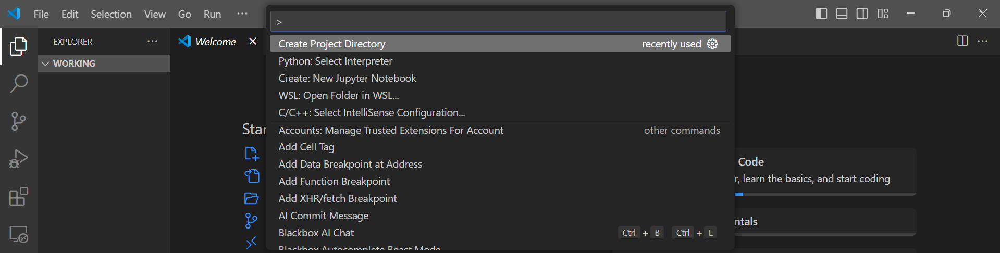
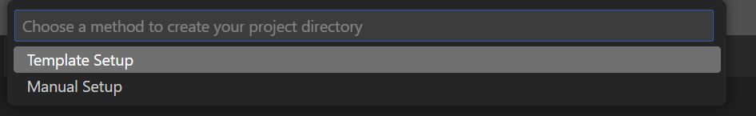
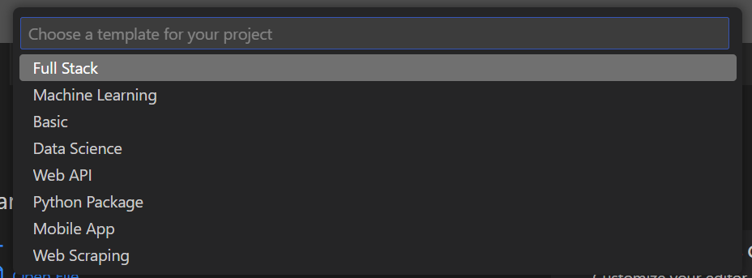
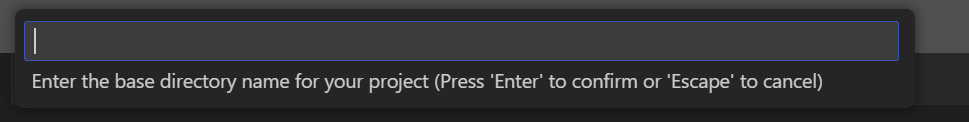

# Project Directory Creator

**Project Directory Creator** is a Visual Studio Code extension that helps developers quickly set up project folder structures based on either predefined templates or custom input. Whether you're working on full-stack development, machine learning, or need a custom setup, this extension simplifies the process by automating directory and file creation.

## Features

- **Template Setup:** Choose from various predefined templates for quick project creation, including:
  - Full Stack Development
  - Machine Learning
  - Data Science
  - Web API
  - Python Package
  - Mobile App
  - Web Scraping
- **Manual Setup:** Customize the folder structure by specifying directory names and creating files with custom file types.
- **File Type Selection:** Supports multiple file extensions like `.js`, `.py`, `.html`, and more.
- **Interactive Prompts:** User-friendly prompts guide you through the process of setting up your project structure.

## Output Screenshots

  
OPTIONS:


### Example: Template Setup



### Example: Manual Setup



---

## Boilerplate Examples

### 1. Full Stack Boilerplate

```
FullStackProject/
│
├── client/
│   ├── public/
│   │   ├── index.html
│   │   └── favicon.ico
│   ├── src/
│   │   ├── components/
│   │   │   ├── App.js
│   │   │   └── Header.js
│   │   ├── App.js
│   │   └── index.js
│   ├── package.json
│   └── webpack.config.js
│
├── server/
│   ├── controllers/
│   │   ├── userController.js
│   │   └── authController.js
│   ├── models/
│   │   ├── userModel.js
│   │   └── postModel.js
│   ├── routes/
│   │   ├── userRoutes.js
│   │   └── postRoutes.js
│   ├── server.js
│   ├── config/
│   │   └── db.js
│   └── package.json
│
└── README.md
```

- `client/`: Contains the front-end code (React, Vue, Angular).
- `public/`: HTML and static files.
- `server/`: Backend code (Node.js/Express).

---

### 2. Machine Learning Boilerplate

```
MLProject/
│
├── data/
│   ├── raw/
│   │   └── dataset.csv
│   ├── processed/
│   │   └── cleaned_data.csv
│
├── notebooks/
│   ├── EDA.ipynb
│   └── model_training.ipynb
│
├── models/
│   ├── model.pkl
│   └── model_performance.txt
│
├── src/
│   ├── preprocess.py
│   ├── train.py
│   └── predict.py
│
├── requirements.txt
├── README.md
└── main.py
```

- `data/`: Raw and processed data storage.
- `notebooks/`: Jupyter notebooks for EDA and model training.
- `src/`: Python scripts for preprocessing, training, and prediction.

---

### 3. Basic Boilerplate

```
BasicProject/
│
├── src/
│   ├── index.html
│   ├── styles.css
│   └── app.js
│
├── assets/
│   ├── images/
│   └── icons/
│
└── README.md
```

- `src/`: Core project files.
- `assets/`: Folder for storing images, icons, or other media assets.

---

### 4. Data Science Boilerplate

```
DataScienceProject/
│
├── data/
│   ├── raw_data.csv
│   ├── processed_data.csv
│   └── features.csv
│
├── notebooks/
│   ├── data_cleaning.ipynb
│   ├── feature_engineering.ipynb
│   └── model_evaluation.ipynb
│
├── scripts/
│   ├── data_preprocessing.py
│   ├── feature_selection.py
│   └── model_train.py
│
├── results/
│   ├── accuracy_scores.txt
│   └── confusion_matrix.png
│
├── models/
│   ├── final_model.pkl
│   └── test_predictions.csv
│
└── README.md
```

- `data/`: Contains the raw, processed, and feature data files.
- `notebooks/`: Jupyter notebooks for cleaning, feature engineering, and model evaluation.

---

### 5. Web API Boilerplate

```
APIProject/
│
├── controllers/
│   ├── userController.js
│   ├── authController.js
│   └── productController.js
│
├── models/
│   ├── userModel.js
│   ├── productModel.js
│   └── orderModel.js
│
├── routes/
│   ├── userRoutes.js
│   ├── authRoutes.js
│   └── productRoutes.js
│
├── middleware/
│   └── authMiddleware.js
│
├── config/
│   └── db.js
│
├── server.js
├── package.json
└── README.md
```

---

### 6. Python Package Boilerplate

```
PythonPackage/
│
├── src/
│   └── my_package/
│       ├── __init__.py
│       ├── module1.py
│       └── module2.py
│
├── tests/
│   ├── test_module1.py
│   └── test_module2.py
│
├── setup.py
├── requirements.txt
└── README.md
```

---

### 7. Mobile App Boilerplate (React Native)

```
MobileAppProject/
│
├── src/
│   ├── components/
│   │   └── Button.js
│   ├── screens/
│   │   └── HomeScreen.js
│   ├── App.js
│   └── index.js
│
├── assets/
│   ├── images/
│   └── fonts/
│
├── package.json
└── README.md
```

---

### 8. Web Scraping Project Boilerplate

```
WebScrapingProject/
│
├── data/
│   ├── raw_html/
│   └── scraped_data.csv
│
├── scripts/
│   ├── scraper.py
│   ├── parser.py
│   └── data_cleaner.py
│
├── results/
│   ├── output_data.csv
│   └── data_analysis.ipynb
│
├── requirements.txt
└── README.md
```

---

## Requirements

This extension requires **Visual Studio Code** version **1.75.0** or later.

## Extension Settings

This extension provides the following command, accessible via the **Command Palette** (`Ctrl+Shift+P`):

- **Create Project Directory**: Opens an interactive prompt to set up your project directory structure, either manually or via a template.

## Known Issues

- Currently supports a limited number of project templates.
- Minimal validation for file names and extensions (e.g., invalid or duplicate names are not handled).

## Release Notes

### 0.0.1
- Initial release with template and manual project directory creation.

---

## Development and Contribution

This extension is built using TypeScript. To contribute or extend this project:

1. Clone the repository.
2. Run `npm install` to install the necessary dependencies.
3. Use `npm run compile` to build the extension.

Enjoy creating organized project structures with **Project Directory Creator**!

---

